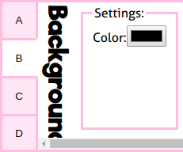

[Help](../index.md) / [Toolbox](../toolbox.md) / Backgrounds panel

# The Backgrounds panel

This panel allow you to select the background for the scene. In the settings fields you can configure the currently selected background. The buttons to the right of it let you select the background.

## Settings

Settings are applied per background. If you change backgrounds and switch back later, the same settings will be restored as were used for the background last time.

### Flipped

If this is checked the background will be flipped horizontally.

### Variant

Some backgrounds (mostly the CGs) have multiple variants. With the "<" buttons ">", you can switch between them.

### Color

This option is only shown when the "Static color" background was chosen. Click on the button for a color chooser. The chosen color will be used as the background. 

## Transparency

Transparency in backgrounds is represented by a checkerboard pattern in the preview. This will **not** be present in final download!
