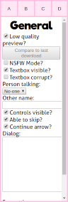

[Help](index.md) / Toolbox

# Toolbox

The toolbox is the primary way to interact with the generator.

It's location is based on the size of your screen. It can either be on the right or bottom, depending on where ever it will waste the least screen space.

## Parts

### The toolbar

The toolbar contains 4 buttons:

- 'A' (Add): this opens the [Add character panel](panels/add.md)
- 'B' (Background): this opens the [Backgrounds panel](panels/backgrounds.md)
- 'C' (Credits): Exactly what it sounds like. Lists the credits for the tool and all assets.
- 'D' (Download): Creates the final render and downloads it.

Since clicking on 'A', 'B' or 'C' opens other panels, they forcefully clear the current [selection](selection.md).

### The Panels

This shows you a lot of options, depending on context. The following types of panels exist:

- [General](panels/general.md): This panel is shown if no object is selected and panel is selected in the toolbar. You can force it to be displayed by clicking on an empty part of the preview image, or clicking twice on 'A', 'B' or 'C'
- [Content Packs](panels/content_packs.md): This panel is shown when you click "Content Packs" in the [General Panel](panels/general.md)
- [Add Character](panels/add.md): This panel is shown when you click on 'A'. It can be used to add objects to the scene.
- [Backgrounds](panels/backgrounds.md): This panel is shown when you click on 'B'. Here, you can select and configure the background of the scene.
- [Credits](panels/credits.md): This panel is shown when you click on 'C'. It shows the sources of all assets used.
- [Character](panels/character.md): This panel is shown when you select a character and allows to configure it.
- [Sprite](panels/sprite.md): This panel is shown when you select a sprite and allows to configure it.
